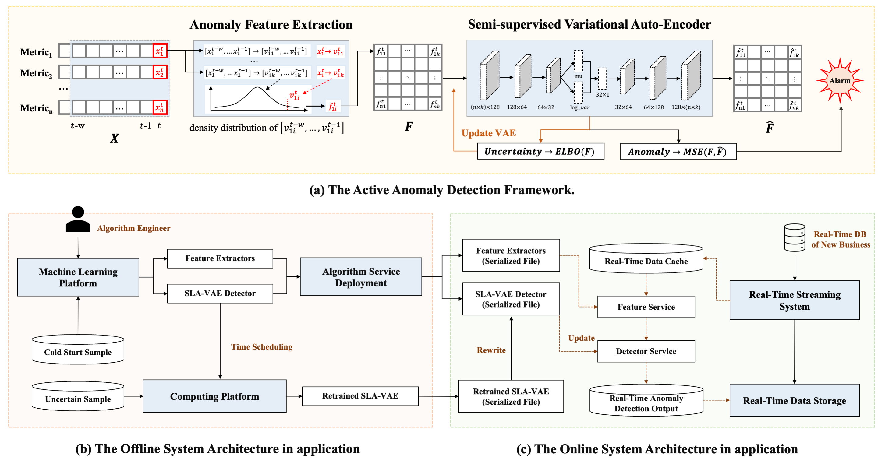

## SLA-VAE


#### A Semi-Supervised VAE Based Active Anomaly Detection Framework in Multivariate Time Series for Online Systems

> The structure of SLA-VAE is presented as follows. We provide a semi-supervised VAE based active anomaly detection 
framework in multivariate time series for online systems. It consists of three components, 
namely anomaly feature extraction, semi-supervised variational auto-encoder based anomaly detection, 
and active learning based on model uncertainty.
> * The anomaly definition based on feature extraction module can be available to all multi-variate time series
and represent the anomalies in the same degree.
> * Based on extracted features, we propose semi-supervised VAE to identify anomalies 
to avoid the risk of susceptibility to anomalous input introduced by unsupervised VAE.
> * Then we adopt the active learning and put forward an active anomaly detection framework
so that we can learn and update the online detection model using a small amount of highly uncertain samples.




#### Project Details

Please refer to the two testCases to run the code.

```text
.
├── data                                    """Cold Start Data [model parameters + samples]"""
│   ├── param
│   │   ├── multiple_kpi
│   │   │   └── multi_kpi_ad_param.pkl
│   │   └── single_kpi
│   │       └── kpi_ad_param.pkl
│   ├── sample
│   │   ├── multiple_kpi
│   │   │   └── sample_sets.txt
│   │   └── single_kpi
│   │       └── sample_sets.txt
│   └── sample
│       └── multi_ad.png
├── src                                     """Source Code"""
│   ├── common
│   │   ├── constant.py
│   │   ├── exception.py
│   │   ├── util_thre_rec.py
│   │   ├── utils_cleaning.py
│   │   ├── utils_dataframe.py
│   │   ├── utils_smooth.py
│   │   ├── utils_time_series.py
│   │   ├── utils_timestamp.py
│   │   └── utils_window.py
│   ├── feature
│   │   └── feature_ext.py
│   ├── model
│   │   ├── kde.py
│   │   ├── pid.py
│   │   └── semi_vae.py
│   └── service
│       ├── kpi_ad.py
│       └── multi_kpi_ad.py
└── tests                                   """TestCases"""
    ├── feature
    │   └── test_feature_ext.py
    ├── model
    │   └── test_semi_vae.py
    └── service
        ├── test_kpi_ad.py
        └── test_multi_kpi_ad.py
```
